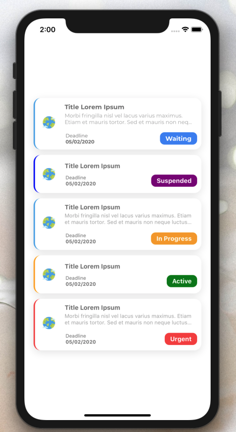

[](https://github.com/Paraboly/@paraboly/react-native-information-card)

[](https://github.com/WrathChaos/@paraboly/react-native-information-card)

[](https://www.npmjs.com/package/@paraboly/react-native-information-card)
[](https://www.npmjs.com/package/@paraboly/react-native-information-card)

[](https://opensource.org/licenses/MIT)
[](https://github.com/prettier/prettier)

<p align="center">
  
</p>

# Installation

Add the dependency:

```ruby
npm i @paraboly/react-native-information-card
```

## Peer Dependencies

###### IMPORTANT! You need install them

```js
"react": ">= 16.x.x",
"react-native": ">= 0.55.x",
"react-native-androw": ">= 0.0.34",
"react-native-material-ripple": ">= 0.9.1"
"react-native-dynamic-vector-icons": ">=0.1.1",
"react-native-vector-icons": ">=6.6.0"
"react-native-svg":">= 12.1.0"
```

# Usage

## Import

```js
import InformationCard from "@paraboly/react-native-information-card";
```

## Basic Usage

```jsx
<InformationCard />
```

## Future Plans

- [x] ~~LICENSE~~

## Author

FreakyCoder, kurayogun@gmail.com

## License

React Native Information Card is available under the MIT license. See the LICENSE file for more info.
